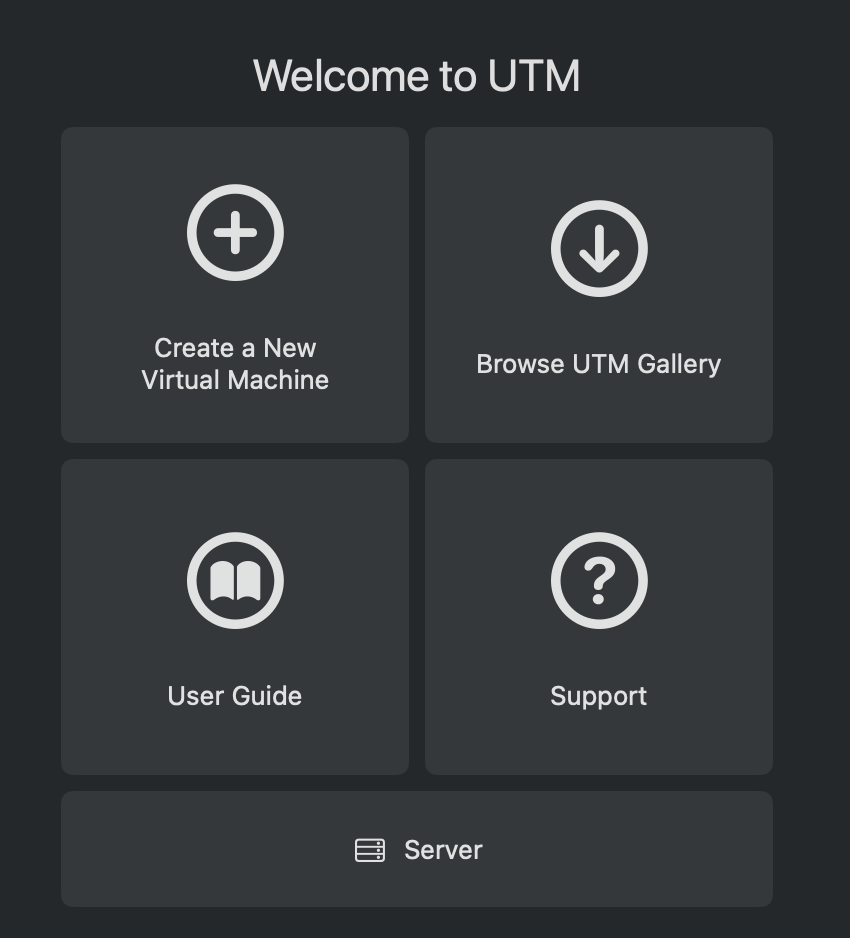
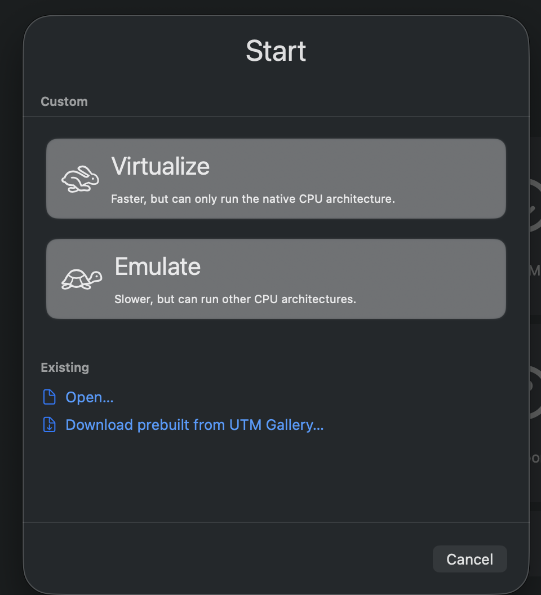
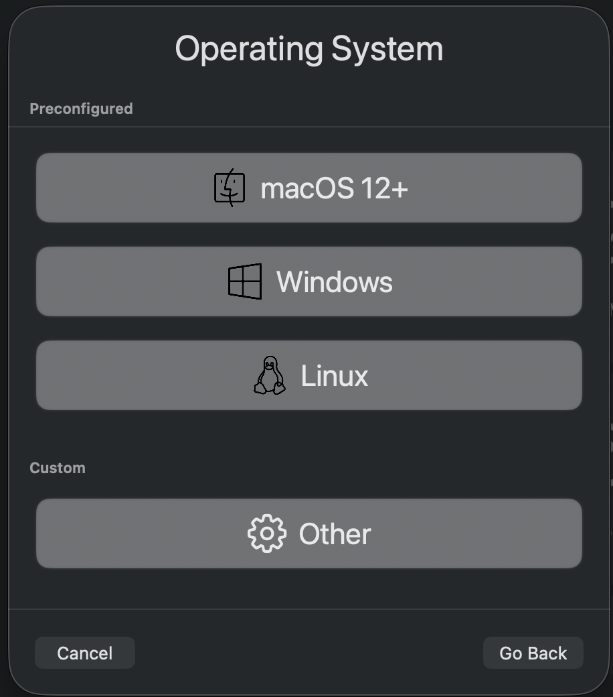
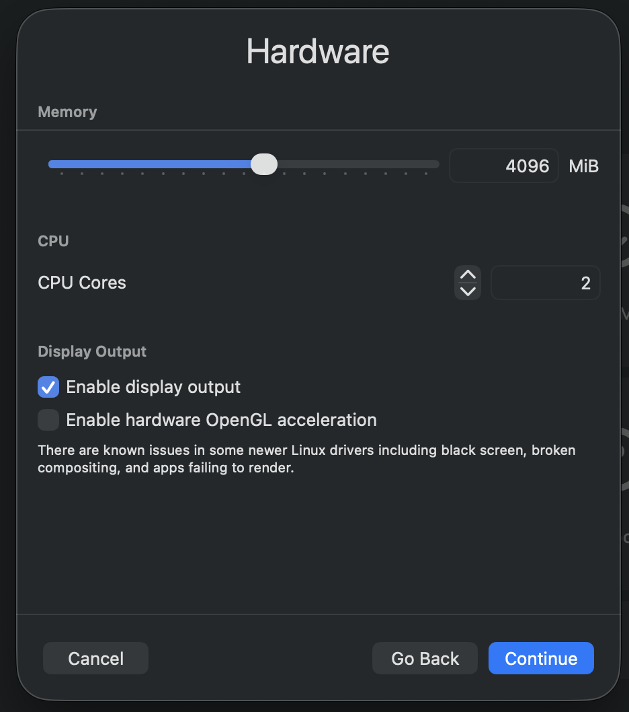
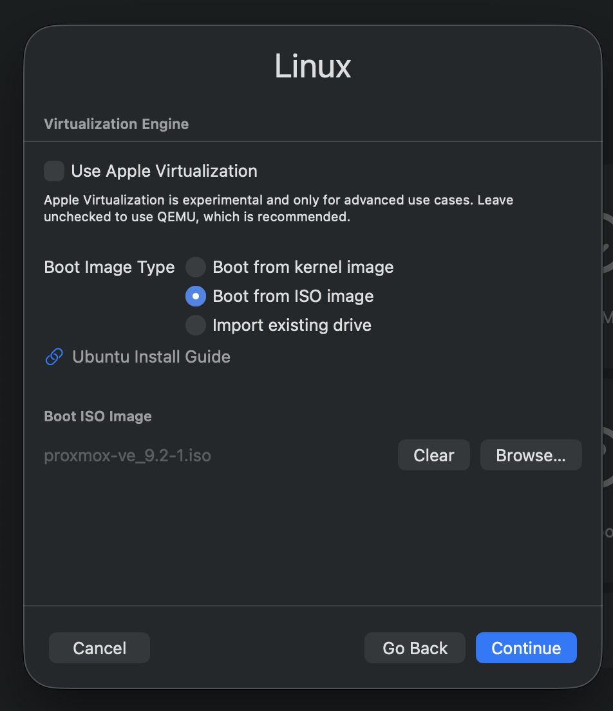

This Application based AI infrastructure system is designed to automatically CICD application to k3s cluster

K3s Cluster Installation

1. Install Proxmox VM

- Download [Proxmox VE x.x ISO](https://www.proxmox.com/en/downloads) - Proxmox VE 9.2 ISO Installer

- Install PVE using Proxmox VE 9.2 ISO in UTM
> 1. Create a new VM
> 
> 2. Choose Virtualize
> 
> 3. Choose Linux OS
> 
> 4. Hardware configuration
> 
> 5. Boot iso image
> 

‼️ VM key configuration

- **Virtualize**: Must select this option (instead of Emulate) to achieve near-native performance.
- **System Architecture**: Select x86_64.
- **Memory**: Recommend 4096MB or more.
- **CPU Cores**: Recommend 2 or more.
- **CPU Mode** (Crucial): In the CPU tab, set the CPU mode to host. This ensures that your Mac's CPU virtualization instruction sets can pass through to the internal Proxmox environment; otherwise, Proxmox will be unable to start its own virtual machines.
- **Network**: Select Bridge (Bridged mode) or Shared Network to ensure Proxmox can obtain an independent IP address.

安装 PVE：在你的 UTM（或未来的 BeeLink）中，使用这个 .iso 文件创建一个虚拟机，并将其安装好。
	2.	获取 Web 管理权：安装完成后，它会给你一个 IP 地址（例如 https://192.168.x.x:8006）。你通过浏览器访问这个地址，看到登录界面，就说明成功了。
	3.	连接 Terraform：安装好系统后，我们需要回到代码层面，通过 API 让 Terraform 连接到这个 PVE。

